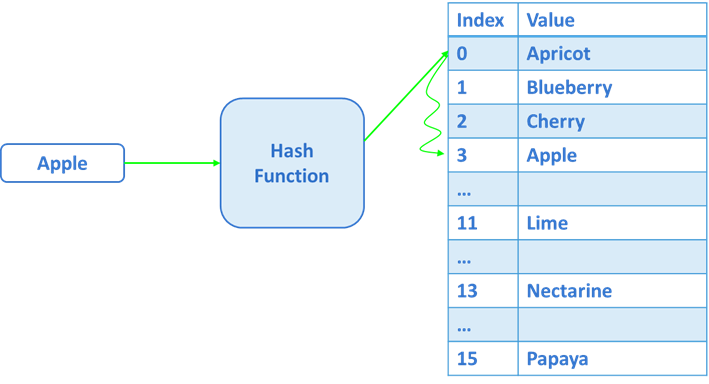

# Hash

> A convenient and common data structure is an array. The advantage of an array is accessing an array element in O(1)
> if the element's index is known. If the index is not known, the searching for an element takes O(log n) in a sorted
> array and O(n) in an unsorted one. Which may not be efficient for a large dataset.
> So no we need a data structure that can store and search data in constant time, which is O(1) time. This structure is a hash table.

## Hash Table

A hash table is an array in which the location of an element depends on the value of the element itself. The relation between the value
of an element and its position in the hash table is determined by the hash function. An important property of the hash table:
searching, inserting and removing elements from the table are performed in O(1) time.


In the example above, the position of each word in the hash table depends on the sequence number of the first letter of that word in the English alphabet

## The concept of a hash function

In general, a hash function can be considered a function that takes some element(which needs to be inserted into the hash table), and the result of its work is the position of the given element in the hash table


Examples of hash functions: the sequence number of the first letter of a word in the alphabet, the remained of division by 13, etc.

```
int HashFunction(string key)
{
    int hash = char.ToUpper(key[0]) - 'A';
    return hash % SIZE;
}
```

### Properties of a Good hash function

- Efficiently computable
- Should uniformly distribute the keys(Each table position is equally likely for each)
- Should minimize collisions
- Should have a lowe load factor (number of items in the table divided by the size of the table).

## Collisions

A situation where the same hash value is obtained for different keys is called a collision. For example, we will try to add a new word - apple to the shown earlier based on the first character of the line.


But the cell returned by the hash function already has a value. But still, the new value needs to be written somewhere, and for this is necessary to determine where exactly it will be written.
This is called collision resolution.

## Collision Handling 

Two basic methods are used to handle collisions.

### Separate Chaining

Hash collision handling by separate chaining, uses an additional data structure, preferably linked list for dynamic allocation, into buckets.

In our example, when we add an apple to the table, it appended to the linked list stored a the index 0, then our table would look like this.


To find an item we first go to the table and then compare keys. This is a popular method, and if a list of linked is used the hash never fills up.

The main drawback of chaining is the increase in time complexity. Instead of O(1) as with a regular hash table, each look up will take more time since we need to traverse each linked list to find the correct value

### Open Addressing 

Open addressing does not introduce any new data structure. If a collision occurs then we look for availability in the next spot generated by and algorithms. Open Addressing is generally used where storage space is restricted.

Methods for Open Addressing

***Linear probing***.
In linear probing, the hash table is searched sequentially that starts from the original location of the hash. If in case the location that we get is already occupied, then we check for the next location.

*Algorithm*:

1. Calculate the hash key
2. Check, if hashTable[key] is empty - store the value directly by hashTable[key] = data
3. If the hash index already has some value, then check for the next index using key = (key+1) % size
4. Check, if the next index is available hashTable[key] then store the value. Otherwise, try for the next index.
5. Do the above process till we find the space.



***Quadratic Probing***

Quadratic probing operates by taking the original hash index and adding successive values of an arbitrary quadratic polynomial until an open slot is found.

For example, the sequence using quadratic probing is:

`H + 1^2, H + 2^2, H + 3^2, H + 4^2, … , H + k^2`

This method is also known as the mid-square method because in this method we look for i^2‘th probe (slot) in i’th iteration and the value of i = 0, 1, … n – 1. We always start from the original hash location. If only the location is occupied, then we check the other slots.

***Double Hashing***

Double hashing make use of two hash function:

- The first hash function is h1(k) which takes the key and gives out a location on the hash table. If the new location is not occupied or empty then we can easily place our key.
- But in case the location is occupied (collision) we will use the secondary hash-function h2(k) in combination with the first hash-function h1(k) to find the new location on the hash table.
This combination of hash functions is of the form

h(k, i) = (h1(k) + i · h2(k)) % n, where

i - is a non-negative integer that indicates a collision number,

k - element/key which is being hashed

n - hash table size.

## Application of hash

1. Hash is used in databases indexing.
2. Hash is used in disk-based data-structures.
3. In some programming languages like Python, JavaScript hash is used to implement objects.
4. Hash is used for cache mapping fast access to data.
5. Hash can be used for password verification.
6. Hash is used in cryptography as message digest.


